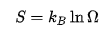

### 통계역학적 정의

통계역학에서는 엔트로피의 차 뿐만 아니라 엔트로피의 절대적 값을 정의할 수 있다. 확률적 상태 분포를 가지는 어떤 계의 [앙상블](https://ko.wikipedia.org/wiki/앙상블_(물리학))을 생각하자. 여기서 단일계의 상태(미시적 상태) {\displaystyle i}

라고 하자. 이 경우, 앙상블의 

엔트로피는 다음과 같이 정의한다.

고립된 계의 경우, 통상적으로 모든 미시적 상태의 확률이 같다고 가정한다. 즉 

{\displaystyle p_{i}=1/\Omega } (여기서 {\displaystyle \Omega }

는 가능한 미시적 상태의 수)다. 이 경우

다. 여기서 *k*B 는 [볼츠만 상수](https://ko.wikipedia.org/wiki/볼츠만_상수)다. 이 식은 [루트비히 볼츠만](https://ko.wikipedia.org/wiki/루트비히_볼츠만)이 처음 발견하였다.